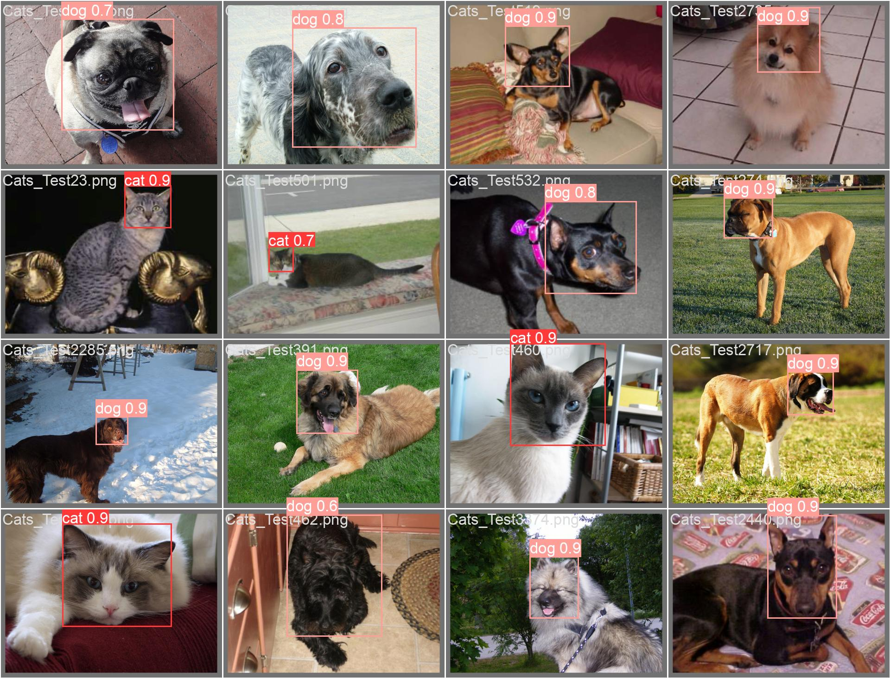

# Custom Object Detection and Novel Bounding Box Metric with YOLO

This project focuses on building a custom YOLOv5 model to detect cats and dogs in images. It walks through preparing the data, processing annotations, training the model, and assessing its performance.

## Installation

Clone repo and install [requirements.txt](https://github.com/ultralytics/yolov5/blob/master/requirements.txt) in a [**Python>=3.8.0**](https://www.python.org/) environment, including [**PyTorch>=1.8**](https://pytorch.org/get-started/locally/).


```bash
git clone --branch ultralytics/yolov5 https://github.com/SasiniWanigathunga/yolov5.git
cd yolov5
pip install -r requirements.txt
```

### Data

Download the dataset using:

```bash
python datasets/download_kaggle_cat_dog.py
```
and place the images and annotations directories in the datasets/dog-cat-detection/ folder. Preprocess the dataset using the follwoing code:

```bash
python dataset_preparation.py
```

This script converts XML annotations to the YOLO format and prepares the dataset for training. The dataset folder structure will be:


```bash
.
├── datasets
│   ├── dog-and-cat-detection
│   │   ├── annotations  
│   │   ├── images                  
│   │   ├── labels
│   │   ├── train 
│   │   │   ├── images 
│   │   │   ├── labels                 
│   │   ├── val   
│   │   │   ├── images 
│   │   │   ├── labels          
```

## Training

Download [**yolov5s**](https://github.com/ultralytics/yolov5/releases/download/v7.0/yolov5s.pt) checkpoint using the following command.

```bash
wget https://github.com/ultralytics/yolov5/releases/download/v7.0/yolov5s.pt
```

Run the following command to start training the YOLOv5 model:

```bash
python train.py --img 640 --batch 32 --epochs 10 --data data/data.yaml --weights yolov5s.pt --device 0
```

This script will train the model, evaluate it on the validation set and save the visualizations and training curves.

## Evaluation

The model will be evaluated for the validation dataset when you run the above training script.

## Quantitative Results

| Method                   | mAP@0.5 | mAP@0.95 | Custom bounding box similarity metric |
|--------------------------|---------|----------|-----------------------------------------|
| Baseline                 | 0.989   | 0.817    | 0.965                                   |
| Baseline + Custom Loss   | 0.989   | 0.824    | 0.966                                   |

## Qualitative Results



## Notes

- Please note that [**Dog and Cat Detection dataset on Kaggle**](https://www.kaggle.com/datasets/andrewmvd/dog-and-cat-detection) is the dataset used and it for detecting the faces of the cats and dogs.